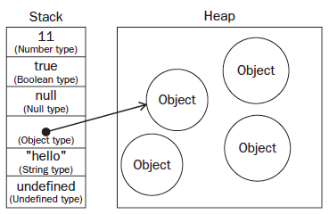
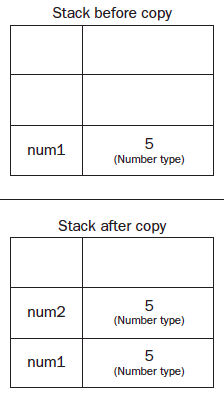
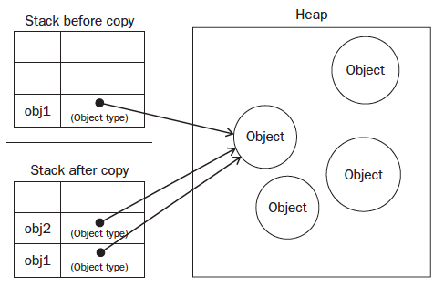
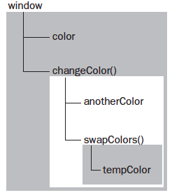

# Book Notes on JavaScript for Web Developers

## 1. What is JavaScript?

**JavaScript** is a scripting language designed to interact with web pages.

######3 distinct parts:
- ECMAScript - defined in ECMA-262 and provides the core functionality
- Document Object Model (DOM) - provides methods and interfaces for working with
the content of a web page
- Browser Object Model (BOM) - provides methods and interfaces for interacting with
the browser

######Browser compatibility:
- ECMAScript - good across all browsers
- DOM - varies widely
- BOM - no standard, some commonalities

## 2. JavaScript in HTML

- Insert JavaScript to HTML in two ways: **inline** or from **external file**.
- Declare `type` attribute as "text/javascript".
- Set `src` to the URL of the file.

*inline JavaScript*
```
<script type="text/javascript" src="jquery.min.js"><script>
```
*JavaScript from external file*
```
<script type="text/javascript" src="https://ajax.googleapis.com/ajax/libs/jquery/1.11.2/jquery.min.js"></script>
```

- All `<script>` elements are interpreted in the order in which they occur on the page.
- `<script>` elements are usually included toward the end of the page, just before the closing `</body>` tag.
- Defer a script’s execution until after the document has rendered by using the `defer` attribute (for IE only).
- Use `<noscript>` to specify that content is to be shown only if scripting support isn’t available on the browser.

## 3. Language Basics

### On Syntax
1. Case-sensitivity - `typeof` != `typeOf`
2. Identifiers - starts with a letter, `_`, or `$`; functions are in camelCase
3. Comments - use `//comment` for single line, and `/* comment */` for multi line
4. Statements - use semicolons `;` for single lines, and code blocks `{ }`for multiple & control statements

### Variables
- loosely-typed (can hold any type of data, though not best to switch from one to another)
- `var` to define a variable in local scope e.g.`var name='Nadine';`
- no `var` to define a variable globally (not recommended) e.g. `name='Nadine';`
- define multiple variables e.g. `var message='hi', name='nadine', age='23';`

### Data Types

##### Primitive types
1. Undefined - any uninitialized variable
2. Null - empty object pointer
3. Boolean - `true` or `false` (distinct from `1` and `0`)
4. Number - convert to number using `Number()`, `parseInt()`, `parseFloat()`; `NaN` when not a number
5. String - convert to string using `toString()`, `String()`

##### Complex type
6. Object (unordered list of name-value pairs)

Determine data type with `typeof` operator. e.g. `alert(typeof 23);`

### Operators

##### Unary Operators - works on only one value
- Increment/Decrement
	- prefix
		- `++variable;` --> `variable = variable + 1;`
		- `--variable;` --> `variable = variable - 1;`
	- postfix
		- `variable++;` or `variable--;`
		- works the same way as prefix
		- executed only after the containing statement is evaluated
- Unary Plus and Minus
	- `+variable;` or `-variable`
	- performs the `Number()` casting function
	- minus `-` applies `Number()` and negates the value
	
##### Bitwise Operators - works with bits that represent numbers (32-bit integer)
- Bitwise NOT (`~`)
	- returns one's complement of the number
	- negates a number and subtracts 1
- Bitwise AND (`&`)
	- lines up the bits in each number and performs an AND operation between the two bits in the same position
- Bitwise OR (`|`)
	- lines up the bits and performs an OR operation
- Bitwise XOR (`^`)
	- lines up the bits and returns 1 only when exactly one bit has a value of 1
- Left Shift (`<<`)
	- shifts all bits in a number to the left by the
number of positions given
	- left shift fills
empty bits with 0s to make the result a complete 32-bit number
	- preserves the sign of the number it's operating on
- Signed Right Shift (`>>`)
	- shifts all bits to the right while preserving the sign
	- the empty bits occur at the left of the number after the "sign bit"
- Unsigned Right Shift (`>>>`)
	- shifts all bits to the right
	- empty bits get filled with zeros regardless of the sign of the number
	
##### Boolean Operators
- Logical NOT (`!`) 
	- converts the operand to a Boolean value and then negates it
	- use `!!` to sumulate `Boolean()`
- Logical AND (`&&`)
	- short-circuited - if the 1st operand is *false*, the 2nd operand will never be evaluated
- Logical OR (`||`)
	- short-circuited - if the 1st operand is *true*, the 2nd operand will never be evaluated
	- used to avoid assigning a null or undefined value to a variable 
	- e.g. `var myObject = preferredObject || backupObject;`
	
##### Multiplicative Operators
If either operand is NaN, it is converted to a number using `Number()`.

- Multiply (`*`)
- Divide (`/`)
- Modulus (`%`)

##### Additive Operators
- Add (`+`)
	- If both operands are strings, the second string is concatenated to the first.
	- If only one operand is a string, the other operand is converted to a string and the result is the
concatenation of the two strings.
	- If either operand is an object, number, or Boolean, its `toString()` method is called.
	- surround two number variables by parentheses before concatenating
- Subtract (`-`)
	- If either operand is a string, a Boolean, null , or undefined , it is converted to a number using `Number()`
	- If either operand is an object, `valueOf()` is called. If that value is `NaN`, then the result is NaN . If the object doesn’t
have `valueOf()` defined, then `toString()` is called and then `Number()`


##### Relational Operators

- less-than (`<`)
- greater-than (`>`)
- less-than-or-equal to (`<=`)
- greater-than-or-equal to (`>=`)

Rules:

- If the operands are strings, compare the character codes of each corresponding character in
the string.
	- the character codes of uppercase letters are all lower than the character codes of lowercase letters
	- convert strings to lowercase e.g. `“Brick”.toLowerCase();`
- If one operand is a number, convert the other operand to a number.
- If an operand is an object, call `valueOf()`. If not available, call `toString()`.
- If an operand is a Boolean, convert it to a number.

##### Equality Operators
- Equal (`==`) and Not Equal (`!=`)
- Identically Equal (`===`) and Not Identically Equal (`!==`)
	- they do not convert operands before testing for equality
	- It is recommended to use this operator to maintain data type integrity throughout your code.
	
##### Conditional Operator
- `variable = boolean_expression ? true_value : false_value;`

##### Assignment Operator
- done with `=` and assigns the value on the right to the
variable on the left
- Compound-assignment operators (shorthand only; no performance improvement)
	- Multiply/assign ( `*=` )
	- Divide/assign ( `/=` )
	- Modulus/assign ( `%=` )
	- Add/assign ( `+=` )
	- Subtract/assign ( `-=` )
	- Left shift/assign ( `<<=` )
	- Signed right shift/assign ( `>>=` )
	- Unsigned right shift/assign ( `>>>=` )

##### Comma Operator
- used in the declaration of variables e.g. `var num1=1, num2=2, num3=3;`
- It can also be used to assign values; It always returns the last item in an expression e.g. `var num = (5, 1, 4, 8, 0); //num becomes 0`
	

### Statements

##### *if* statement 
- syntax: `if (condition) statement1 else statement2`
- always use block statements
- automatically converts the result of the expression into a Boolean by calling `Boolean()`
- allows chaining

##### *do-while* statement 
- syntax: `do { statement } while (expression);`
- a post-test loop - the escape condition is evaluated only
after the code inside the loop has been executed
- the body of the loop should be
executed at least once before exiting

##### *while* statement 
- syntax: `while (expression) statement`
- a pretest loop - the escape condition is evaluated before the code inside the loop has been executed

##### *for* statement 
- syntax: `for (initialization; expression; post-loop-expression) statement`
- e.g. `var count = 10;
for (var i=0; i < count; i++){
alert(i);
}`
- Nothing can be done with a for loop that can ’ t be done using a while loop.
- A variable defined inside the loop is accessible outside the loop as well.

##### *for-in* statement
- syntax: `for (property in expression) statement`
- strict iterative statement - used to enumerate the properties of an object
- The var operator in the control statement is not necessary but is recommended for ensuring the use of a local variable.

##### Labeled statement
- syntax: `label: statement`
- can be referenced later by using the `break` or `continue` statement

##### *break* and *continue* statements
- provide stricter control over the execution of code in a loop
- `break` exits the loop immediately, forcing execution to continue with the next statement after
the loop
- `continue` exits the loop immediately, but execution
continues from the top of the loop


##### *with* statement
- syntax: `with (expression) statement;`
- sets the scope of the code within a particular object
- created as a convenience for times when a single object was being coded to over and over again
- widely considered a poor practice to use the with statement in production code

##### *switch* statement
- For each case, if the expression is equal to the value, the statement is executed.
- `break` causes code execution to jump out of the switch statement
- without `break`, code falls through (always put comment if done on purpose)
- `default` indicates what is to be done if the expression does not evaluate to one of the cases
- works with all data types, can be used with strings and objects
- Case values need not be constants; they can be variables and even expressions.
- Values are compared using the identically equal operator, so no type coercion occurs.

```
switch (expression) {
	case value: statement
		break;
	case value: statement
		break;
	case value: statement
		break;
	case value: statement
		reak;
	default: statement
}
```


### Functions
Functions allow the encapsulation of statements that can be
run anywhere and at any time.

```
function sum(num1, num2) {
 return num1 + num2;
}
```
- Return a value anytime by using the `return` statement. 
- A function stops and exists when `return` is encountered. 
- Without a return value, function returns `undefined`.

##### Arguments

- no. of arguments passed in and data types don't matter
- no *function signature*
- `arguments` - an **array** containing zero or more values where arguments are passed
	- Any number of arguments can be passed into a function and are accessible through the `arguments` object.
	- `arguments` object can be used in conjunction with named arguments.
	- `arguments` object can also be used to check the number of arguments passed into the function via the length property.
- Any named argument that is not passed into the function is automatically
assigned the value `undefined`.

```
function sayHi() {
	alert(“Hello “ + arguments[0] + “,” + arguments[1]);
}
```

##### No Overloading

- no overloading due to lack of function signatures
- if same name, the last function becomes the owner of that name
- simulate overloading by checking the type and number of arguments that have been passed into a function, and then reacting accordingly


## 4. Variables, Scope, and Memory


**variable** - loosely typed; a name for a particular
value at a particular time

### Primitive and Reference Values


#####Primitive values

- i.e. boolean, null, undefined, number, string
- data that are stored in one memory locatin on the *stack*, takes up a fixed amount of space
- variables are said to be accessed by *value*


#####Reference values

- value is just a pointer to another memory location (in the *heap*) where the object is stored
- cannot be stored on the stack because they don't have fixed sizes
- a memory address has a fixed size, so it is placed on the *stack*
- objects may require different amounts of memory so heap is not accessed sequentially


#### Dynamic Properties

#####Primitive values 
- can’t have properties added to them

#####Reference values 
- properties and methods may be defined dynamically (added, changed, or deleted) at any time for later use

```
var person = new Object();
person.name = “Nicholas”;

```

#### Copying Values

#####Primitive values 
- copied value is completely separate from original variable



#####Reference values
- copied value is actually a pointer to the same object stored on the heap
- changes to one are reflected on the other


####Argument Passing
- *passed by value* - same way a variable is copied
- noting more than local variables
- passing in a reference value -`obj` is accessing an object by reference, even though it was passed into the function by value
- When `obj` is overwritten inside the function, it becomes a pointer to a local object, which is destroyed

#### Determining Type

#####Primitive values 
- use `typeof` operator

#####Reference values
- use `instanceof` operator
- syntax: `result = variable instanceof contstructor`
- returns `true` if the variable is an instance of the given reference type

### Execution Context and Scope
*Execution Context* - defines what other data a variable or function has access to, and how it should behave (i.e. variable object)

#####Global
- outermost execution context
- global variables and functions - created as properties and methods on the `window` object
- destroyed when the application exits

#####Local
- function's context is pushed onto a context stack
- when finished executing, stack is popped, and control is returned to previously executing context

#####*Scope Chain* of variable objects

- created when code is executed in a context
- provides ordered access to all variables and functions that an execution context has access to
- front of the scope chain - variable object of the context
- end of the scope chain - global context




- rectangles - represent execution contexts
- inner context - **can access everything** from all outer contexts through the scope chain
- outer contexts - **cannot access anything** within an inner context

#### Scope Chain Augmentation
Temporary addition to the front of the scope chain (removed after code execution):

- the `catch` block in a `try-catch` statement
- a `with` statement

#### No block level scopes

```
if (true) {
    var color = “blue”;
}
alert(color); //”blue”
```
####Variable declaration
If a variable is initialized without first being declared (no `var`), it gets
added to the global context automatically.

####Identifier Lookup

The search starts at the front of the scope chain,
looking for an identifier with the given name. This process continues until the search reaches the global context’s variable object.



### Garbage Collection
*execution environment* - responsible for managing the memory required during code execution

*2 strategies:*

#####A. Mark-and-Sweep
1. Mark all variables stored in memory.
2. Clear marks off of variables that are in context, including referenced variables.
3. Do a *memory sweep* by destroying marked values and reclaiming memory.


#####B. Reference Counting 
1. Every value keeps track of *how many references* are made to it.
2. When the reference count of a value reaches zero, the memory is reclaimed.
3. This causes problems when circular references exist.

#####Performance
*garbage collector*

- runs **periodically**
- can potentially be an **expensive process** if there is a large number of variable allocations in memory
- **timing** is important


#####Managing Memory
*dereferencing* 

- freeing up the reference when data is not necessary
- best to set the value to `null` (esp. global variables)


##5. Reference Types

- *Reference types* - similar to classes but implemented differently
- *reference values* - called "objects", can be created with built-in *reference types* 

###The Object type 
- base from which all other reference types inherit basic behavior
- 2 ways to create an instance:
	1. `new` operator - e.g. `var person = new Object();`
	2. object literal notation - e.g. `var person = {};`
	
###The Array type 
- represents an ordered list of values
- 2 ways to create an instance:
	1. `new` operator - e.g. `var colors = new Array();`
	2. array literal notation - e.g. `var colors = [];`
- provides functionality for manipulating and converting the values
	- Conversion - `toLocalString()`, `toString()`, `valueOf()`, `join()`
	- Stacking - `push()`, `pop()`	
	- Queuing - `shift()`, `push()`, or `unshift()`, `pop()`
	- Reordering - `reverse()`, `sort()`
	- Manipulation - `concat()`, `slice()`, `splice()`
		- deletion
		- insertion
		- replacement
	
###The Date type
- info on dates and times (i.e. current & calculations)
- create an instance with`new` operator
	- current date - e.g. `var now = new Date();`
	- from string- e.g. `var someDate = new Date(“May 25, 2004”);`	- UTC - e.g. `var y2k = new Date(Date.UTC(2000, 0));`
- inherited methods
	- `toLocaleString()` - includes AM or PM for the time
	- `toString()` - includes timezone information
	- `valueOf()` - best for ordering, returns milliseconds
- formatting
	- `toDateString()`
	- `toTimeString()`
	- `toLocaleDateString()`
	- `toLocaleTimeString()`
	- `toUTCString()`
- component methods - deals directly with *getting* and
*setting* specific parts of the date value

###The RegExp type
- interface for regular-expression support
- provides regex functionality
- syntax: `var expression = / pattern / flags ;`
- support flags:
	- `g` - global mode
	- `i` - case-insensitive mode
	- `m` - multiline mode
- properties - identifies aspects of a regex
	- `ignoreCase`
	- `lastIndex`
	- `multiline`
	- `source`
- methods
	- `exec()`- for capturing groups, returns info on one match at a time
	- `test()`- checks if pattern matches the argument
	- `toLocaleString()`
	- `toString()`
	- `valueOf()` - returns the regex itself
	
- constructor properties - extracts info about the operations by `exec()` or `test()`
	- `input` or `$_` - original string
	- `lastMatch` or `$&` - last match
	- `lastParen` or `$+` - last matched capturing group
	- `leftContext` or `$`` - string before the matching word
	- `multiline` or `$*` - whether expressions should be multiline
	- `rightContext` or `$'` - string after the matching word
- pattern limitations - some advanced regex features are not available
	
###The Function Type
- function names are pointers to function objects
- create new function

	**function declaration** - function is available before any code is executed

	```
	function sum (num1, num2) {
		return num1 + num2;
	}
	```

	**function expression** - the function isn't available until the line is executed

	```
	var sum = function(num1, num2){
		return num1 + num2;
	};
	```

	**constructor**

	```
	var sum = new Function(“num1”, “num2”, “return num1 + num2")
	```
	
- no overloading because last function overwrites previous one (think of function names as pointers!)
- functions are objects
	- has an `arguments` object
	- refer to the function itself as `argument.callee`
- functions have default properties & methods
	- properties
		- `length` - indicates the no. of named arguments the function expects
		- `prototype` - actual location of all instance methods for reference types
	- non-inherited methods - calls a function within a specific scope, setting the value of the `this` object inside the function body (ability to augment the scope in which a function runs)
		- `apply()` - accepts 2 arguments: the scope in which to run the function, and an array of arguments
		- `call()` - first argument is the scope, but the remaining arguments are passed directly into the function
	- inherited methods - returns the function's code
		- `toLocaleString()`
		- `toString()`
		- `valueOf()`
		
		
###Primitive Wrapper Types
With primitive wrapper types, primitive values in JavaScript can be accessed as if they were objects.

#####3 primitive wrapper types
They should not be instantiated directly!

1. **Boolean**
	- ```var booleanObject = new Boolean(true);```
2. **Number**
	- ```var numberObject = new Number(10);```
	- `toFixed()` - returns a string representation of a number with a specified number of decimal points
	- `toExponential()` - returns a string with the number formatted in exponential notation (aka e-notation)
	- `toPrecision()` - returns either the fixed or exponential representation of a number
depending on which makes the most sense
3. **String**
	- ```var stringObject = new String(“hello world”);```
	- inherited methods
		- `valueOf()`
		- `toLocaleString()`
		- `toString()`
	- property
		- `length` - returns string's no. of characters
	- Character methods
		- `charAt()` - returns the character in the given position as a single-character string
		- `charCodeAt()` - returns the character's character code instead of the actual character
	- String Manipulation methods
		- `concat()` - concatenate one or more strings to another
		- `slice()`
		- `substring()`
		- `substr()`
	- String Location methods
		- `indexOf()` - begins looking for the substring at the beginning of the string
		- `lastIndexOf()` - begins looking from the end of the string
	- string Case methods - if you don't know the language in which the code will be running, use the locale-specific methods
		- `toLowerCase()`
		- `toLocaleLowerCase()`
		- `toUpperCase()`
		- `toLocaleUpperCase()`
	- String Pattern-matching methods
		- `match()` - same as calling `RegExp` object's `exec()` method, accepts a regex string or `RegExp` object
		- `search()` - returns the index of the first pattern occurrence in the string, or –1 if not found
		- `replace()` - accepts 2 arguments: a RegExp object or a string (string is not converted to a regular expression), and a string or a function
		- `split()` - separates the string into an array of substrings based on a separator
	- The `localCompare()` method
		- compares one string to another and returns one of three values as follows
			- If the string should come alphabetically before the string argument, a negative number is returned (most often it's –1).
			- If the string is equal to the string argument, 0 is returned.
			- If the string should come alphabetically after the string argument, a positive number is returned (most often it's 1).
	- The `fromCharCode()` Method 
		- take one or more character codes and convert them into a string
	- HTML Methods
		- e.g. `anchor()`, `big()`, `bold()`, ...
	
#####Characteristics:
- Each wrapper type maps to the primitive type of the same name.
- When a primitive value is accessed in read mode, a primitive wrapper object is instantiated so that it can be used to manipulate the data.
- As soon as a statement involving a primitive value is executed, the wrapper object is destroyed.

###Built-in Objects

No need to explicitly instantiate a built-in object; it is already instantiated.

1. **The `Global` Object**
	- web browsers implement it as the `window` object
	- contains all global variables and functions as properties
	- e.g. `isNaN()`, `isFinite()`, `parseInt()`, `parseFloat()`
	- URI-Encoding Methods
		- `encodeURI()` - works on an entire URI
		- `encodeURIComponent()` - encodes every nonstandard character
		- `decodeURI()`
		- `decodeURIComponent()`
	- The `eval()` Method
		- works like an entire interpreter, accepts a string of JS as an argument
		- might compromise security via code injection
	- Global Object Properties
		- e.g. special values of `undefined`, `NaN`, `Infinity`
		- e.g. native reference type constructors, `Object` and `Function`
	- The Window Object
		- all variables and functions declared in the global scope become
properties on window


2. **The Math Object** 

	- contains properties and methods to aid in complex mathematical calculations
	- Math Object Properties
		- e.g. `Math.E`, `Math.PI`, `Math.SQRT1_2`
	- The `min()` & `max()` methods
	- Rounding methods
		- `Math.ceil()`
		- `Math.floor()`
		- `Math.round()`
	- The `random()` method - returns a random number between the 0 and 1, excluding 0 and 1
	- Other methods
		- e.g. `Math.abs()`, `Math.exp()`, `Math.log()`, ...

